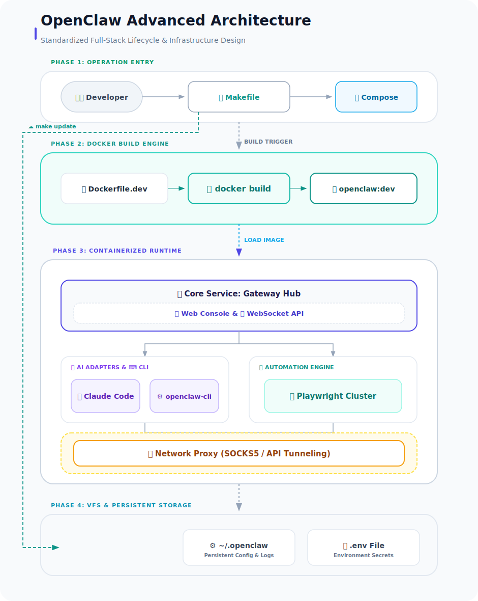

# OpenClaw Development Kit (OpenClaw DevKit)

English | [简体中文](./README.md)

<p align="center">
  <a href="https://github.com/openclaw/openclaw"></a>
  <a href="https://www.docker.com/"></a>
  <a href="https://claude.ai/code"></a>
</p>

**OpenClaw DevKit** provides a complete containerized development, debugging, and runtime environment for the [OpenClaw](https://github.com/openclaw/openclaw) multi-channel AI productivity tool.

It integrates an out-of-the-box toolchain designed to help developers quickly build AI workflows based on OpenClaw, supporting automatic source updates, one-click environment setup, and built-in network optimization for various environments.

---

## 🚥 Quick Start (From Scratch)

If you are cloning this project for the first time, follow these steps to ensure a complete environment setup:

### 1. Prerequisites
Ensure the host machine has:
- **Docker & Docker Compose (V2)**
- **Make** (standard on most Unix-like systems)
- **Network Proxy** (Optional, for accessing Claude/Google APIs in restricted environments)

### 2. Initialize Environment
```bash
# 1. Prepare environment variable file
cp .env.example .env

# 2. Pull OpenClaw core source (Must do for the first time, or image build will fail)
# The script automatically pulls the latest code from GitHub Releases and extracts it to .openclaw_src/
make update

# 3. Initialize Docker development image
# This step handles permission fixes, dependency checks, and image building
make install
```

### 3. Start & Verify
```bash
# 1. Start services
make up

# 2. Verify connectivity (Optional)
# Check connectivity to Google/Claude APIs from within the container
make test-proxy
```

### 4. Access Interface
- **Web Console**: [http://127.0.0.1:18789](http://127.0.0.1:18789)
- **Debug Logs**: `make logs`

---

## ✨ Key Features

- 🚀 **One-Click Environment Setup**: Based on Docker Compose, start a complete development environment in seconds.
- 🛠️ **Dual Image Version Selection**:
    - **Standard Edition (Dockerfile.dev)**: Integrated with Go 1.26, Node 22 LTS, Python 3.13, pnpm, Bun, Playwright, etc.
    - **Java Enhanced Edition (Dockerfile.java)**: Deeply integrated with **JDK 25 (LTS)**, Google Java Format, Checkstyle, architectural checks, and other enterprise-grade tools on top of the standard edition.
- 🤖 **Claude Code Integration**: Native support for Claude Code CLI, providing a premium AI-assisted programming experience.
- 🌐 **Network Optimization**: Built-in proxy forwarding logic for Google and Claude APIs to ensure stability in various network environments.
- 🎥 **Automation Capabilities**: Pre-installed Playwright and all browser dependencies, supporting complex web automation tasks.
- 📝 **Document Processing**: Integrated Pandoc and LaTeX, supporting high-quality document format conversion and generation.
- 💾 **Data Persistence**: Sophisticated Named Volumes ensure that `node_modules`, Go cache, and session data persist across container restarts.

---

## 🏗️ Project Architecture



---

## 🔁 Core Workflow & File Collaboration

To achieve an "out-of-the-box" experience, this project establishes a self-consistent file collaboration system:

1. **Entry Layer (`Makefile`)**: Serves as the primary interface for user operations, encapsulating complex Docker commands and hiding environment interaction complexity.
2. **Initialization Layer (`docker-dev-setup.sh`)**: Triggered by `make install`. It reads `.env` configurations, pre-creates host directory trees, handles permission fixes, and calls `Dockerfile.dev` to build the customized development image.
3. **Orchestration Layer (`docker-compose.dev.yml`)**: The central dispatch center. It defines network abstractions between containers, environment variable injection, and efficient `node_modules` caching using Named Volumes.
4. **Runtime Layer (`Dockerfile.dev`)**: The physical definition of the environment. It integrates Node.js, Go, Python, and Playwright into a single container, eliminating the "it works on my machine" paradox.
5. **Maintenance Layer (`update-source.sh`)**: Automated update mechanism. It monitors version changes via GitHub API, enabling one-click source hot updates and cleanup of old images.

---

## 💬 Slack App Configuration

To enable Slack interaction, please configure your Slack App as follows:

1. **Create App**: Visit the [Slack API Console](https://api.slack.com/apps) and click **"Create New App"**.
2. **Import via Manifest**: Choose **"From an app manifest"** and select your target workspace.
3. **Copy Content**: Copy the contents of `slack-manifest.json` from the project root into the input box (ensure you select YAML/JSON as appropriate).
4. **Enable Socket Mode**: The manifest defaults to `socket_mode_enabled: true`. Confirm **Socket Mode** is enabled in the App settings and generate an **App-level Token** (requires `connections:write` scope).
5. **Install App**: Install the App to your workspace and obtain the **Bot User OAuth Token**.

> [!IMPORTANT]
> Ensure you fill in the obtained `SLACK_APP_TOKEN` (xapp-...) and `SLACK_BOT_TOKEN` (xoxb-...) into your `.env` file.

---

## ⚙️ Configuration Details

Edit the `.env` file in the project root for personalized configuration:

| Variable Name           | Description                     | Example Value                      |
| :---------------------- | :------------------------------ | :--------------------------------- |
| `OPENCLAW_CONFIG_DIR`   | Host configuration storage path | `~/.openclaw`                      |
| `OPENCLAW_GATEWAY_PORT` | Gateway access port             | `18789`                            |
| `HTTP_PROXY`            | Proxy for container internet    | `http://host.docker.internal:7897` |
| `GITHUB_TOKEN`          | Token for `make update`         | `your_github_token`                |

---

## 🛠️ Maintenance Command Manual

| Category         | Command               | Description                                        |
| :--------------- | :-------------------- | :------------------------------------------------- |
| **Lifecycle**    | `make up / down`      | Start / Stop services                              |
|                  | `make restart`        | Restart all services                               |
|                  | `make status`         | View container status and access URLs              |
| **Build/Update** | `make build`          | Rebuild development image                          |
|                  | `make rebuild`        | Rebuild image and restart services                 |
|                  | `make update`         | Fetch latest OpenClaw source from GitHub           |
| **Debug/Diag**   | `make logs`           | Trace Gateway primary service logs                 |
|                  | `make shell`          | Enter container shell (bash)                       |
|                  | `make test-proxy`     | Test connectivity to Google/Claude APIs            |
|                  | `make gateway-health` | Check gateway response status                      |
| **Backup**       | `make backup-config`  | Backup agents and config to `~/.openclaw-backups`  |
|                  | `make restore-config` | Interactively restore specific config files        |
| **Cleanup**      | `make clean`          | Clean up orphan containers and dangling images     |
|                  | `make clean-volumes`  | **WARNING**: Wipe all cache and persistent volumes |

---

## 📂 Directory Structure

| Path                         | Category      | Description                                                                                                  |
| :--------------------------- | :------------ | :----------------------------------------------------------------------------------------------------------- |
| **`Makefile`**               | 🔧 Entry       | **Core Command Set**: Unifies container lifecycle, source updates, health checks, and config backups.        |
| **`docker-compose.dev.yml`** | 🐳 Orchestrate | **Dev Env Definition**: Declares Gateway, CLI, and proxy services; configures Named Volumes for persistence. |
| **`Dockerfile.dev`**         | 🏗️ Build       | **Standard Dev Image**: Integrates Go, Node, Python, Playwright, etc. Base for the DevKit.                   |
| **`Dockerfile.java`**        | ☕ Build       | **Java Enhanced Image**: Adds JDK 25, Gradle, Maven, Spring Boot CLI, and Java auditing tools.               |
| **`.openclaw_src/`**         | 📦 Source      | **OpenClaw Core**: Source code for the automation engine. Supports sync via `make update`.                   |
| **`docker-dev-setup.sh`**    | 🚀 Setup       | **One-Click Logic**: Handles host permission fixes, network pre-checks, `.env` generation, and builds.       |
| **`update-source.sh`**       | 🔄 Sync Tool   | **Source Hot-Pull**: Called by Makefile to auto-sync latest OpenClaw release via GitHub API.                 |
| **`.env` (.example)**        | 🔑 Config      | **Environment Keys**: Stores proxy addresses, API tokens, host path mappings, etc.                           |
| **`docs/`**                  | 📚 Resources   | **Project Assets**: Architecture diagrams, design drafts, and technical specifications.                      |
| **`CLAUDE.md`**              | 🤖 AI Context  | **Agent Guide**: Provides development standards and architectural context for AI assistants.                 |
| **`~/.openclaw`**            | 📂 Host Mount  | **Persistent State**: Stores logs, downloads, Agent configs, and user-defined workflows.                     |
| **`slack-manifest.json`**    | 💬 Slack       | **App Manifest**: Format for importing App configurations into the Slack API dashboard.                      |
| **`.gitignore`**             | 🙈 Git Ignore  | **VC Filter**: Prevents `.env`, `node_modules`, and local caches from being committed.                       |

---

## 🔄 Development Process

1. **Modify Code**: Edit code directly under the `.openclaw_src/` directory.
2. **Apply Changes**: Run `make rebuild`. Build speed is very fast due to `node_modules` caching in Named Volumes.
3. **Verify Results**: Access the Web UI or check `make logs`.
4. **Run Tests**: Use `make exec CMD="pnpm test"`.

---

## ❓ FAQ

**Q: Cannot access the internet or Claude API from within the container?**
A: Ensure your host proxy service (e.g., Clash/V2Ray) has "Allow LAN Connections" enabled, and the port matches those in `.env`. Use `make test-proxy` to verify.

**Q: How to update to the latest official OpenClaw release?**
A: Simply run `make update`. The script handles extraction and directory replacement automatically.

**Q: Changed image configuration but it's not taking effect?**
A: Use `make build` instead of `make up`, or run `make rebuild` directly.

---

## 📄 License

Based on the original license of [OpenClaw](https://github.com/openclaw/openclaw). Please refer to the LICENSE file in the core source for details.
